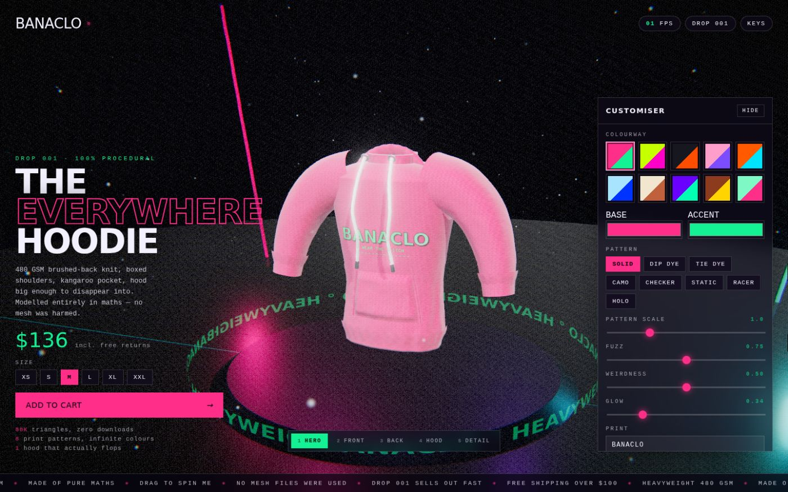
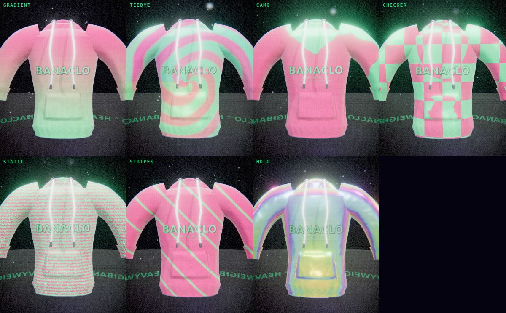

# BANACLO — The Everywhere Hoodie

A funky, fully interactive 3D hoodie configurator built with [Three.js](https://threejs.org/).

Every stitch of the garment is **generated procedurally in the browser** — there is no
`.glb`, no `.obj`, no texture download. The torso, shoulders, sleeves, hood, kangaroo
pocket, ribbed cuffs, waistband, drawstrings and aglets are all lofted from profile
curves and roughed up with fractal noise at load time (~88k triangles, built in
about 200 ms).





## Run it

```bash
npm install
npm run dev        # http://localhost:5173
```

```bash
npm run build      # -> dist/
npm run preview    # serve the production build
```

The build is a static bundle: drop `dist/` on any host. It needs to be *served*
(ES modules don't load over `file://`).

## What you can do with it

| | |
|---|---|
| **10 colourways** | each one repaints the garment, the lining, the text ring and the room it stands in |
| **8 pattern shaders** | solid, dip dye, tie dye, camo, checker, static, racer stripes, hologram |
| **Custom colours** | independent base + accent pickers; the lining always runs the colourway backwards |
| **Live screen print** | type your own two lines — the graphic is rasterised to a canvas and planar-projected onto the chest |
| **Hood up / down** | the hood pivots at the neck and collapses along its own axis, so "down" lies on the back as a flattened roll |
| **Fuzz / weirdness / glow** | sheen and knit contrast, chromatic aberration and grain, bloom strength |
| **X-ray** | wireframe the whole garment |
| **Snapshot** | downloads a PNG of the current configuration |

### Keyboard

`drag` spin · `scroll` zoom · `H` hood · `R` randomise · `X` x-ray · `space` auto-spin ·
`1`–`5` camera views · `S` snapshot · `double-click` hood

## How the hoodie is built

`src/scene/geometry.js` provides the toolbox — Catmull-Rom scalar splines, 3D value
noise / fBm, superellipse cross-sections, ring lofting and a variable-radius sweep
along a curve.

`src/scene/hoodie.js` uses it to grow the garment:

- **Torso** — a stack of 72 superelliptical rings. A superellipse (rather than a plain
  ellipse) is what gives a garment its flat-ish front and back panels. Each vertex is
  pushed along the cross-section normal by fBm noise, bunched towards the hem and
  pulled taut across the shoulders.
- **Yoke** — lofts the top body ring up into a smaller neck ring, with a cosine-shaped
  bulge over the shoulder caps for the sleeve heads to sit on.
- **Sleeves** — a variable-radius superelliptical tube swept along a Catmull-Rom curve
  using Frenet frames, starting *inside* the torso so there's no seam gap.
- **Hood** — an ellipsoid whose polar cut-off varies with azimuth
  (`θmax(φ) = 2.06 − 0.74·cos φ`), which is exactly a tilted plane slicing a sphere:
  the opening faces forward and the back skirt reaches down the shoulders. It renders
  twice, `FrontSide` in the shell colour and `BackSide` in the lining colour.
- **Pocket** — a patch sampled off the torso surface and pushed outwards by a feathered
  falloff, so it welds into the body with no free edges, with piping swept along the
  slanted hand openings.
- **Ribbing** — cuffs, waistband and collar modulate their radius with a cosine. Rib
  counts are kept well under the radial sample count and the scallop fades out at the
  raw edges, otherwise the ripple aliases into a fringe.

`src/scene/materials.js` patches `MeshPhysicalMaterial` through `onBeforeCompile`:
procedural pattern colour, a knit-loop field that darkens the loop valleys and
modulates roughness, a fresnel "loose fibre" halo, and the projected screen print —
all on top of three's real PBR lighting and cloth sheen.

## Layout

```
index.html              markup for the HUD, loader and customiser
src/
  main.js               renderer, camera, orbit + fly-to, app API
  styles.css            neon-brutalist chrome
  scene/
    geometry.js         splines, noise, superellipses, lofting, sweeping
    hoodie.js           the garment
    materials.js        fabric shader + pattern library
    stage.js            backdrop, floor, neon tubes, dust, text ring, lights
    post.js             bloom + chromatic aberration / grain / glitch pass
    textures.js         canvas-generated print, ring text, radial fade
  ui/
    ui.js               control wiring
    presets.js          colourways, patterns, sizes, pricing
    confetti.js         add-to-cart burst
```

## Poking at it from the console

The app exposes itself as `window.BANACLO`:

```js
BANACLO.setPattern('holo');
BANACLO.setColor('#00ff88');
BANACLO.setHoodUp(true);
BANACLO.flyTo('hood');                                  // named view
BANACLO.flyTo({ pos: [1.2, 0.3, 0.6], target: [0, 0, 0] });  // or an inline one
```

## Notes

- Camera moves interpolate in **spherical** space around the orbit target. Lerping
  world positions fights `OrbitControls`, which re-derives its spherical state from the
  camera every frame and clamps the radius — a straight-line path near the target gets
  snapped to `minDistance`.
- The shopping flow (price, sizes, add to cart) is a front-end demo. Nothing is sent
  anywhere and there is no backend.
- Requires WebGL 2. Without it the page shows a fallback message instead of failing silently.

## Licence

MIT.
