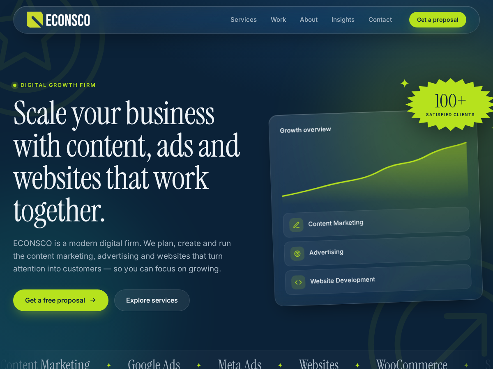

# ECONSCO WordPress theme

A custom glassmorphic WordPress theme for ECONSCO, a digital growth firm offering content
marketing, advertising and website development. It uses the brand navy (`#0b2238`) and
lime (`#b6e21d`) colours.

## What you get

- **Pages:** Home, Services, Work, About, Insights (blog) and Contact. Each has its own
  template (`front-page.php`, `page-{slug}.php`).
- **One-click setup:** activating the theme creates those pages, sets Home as the front
  page and Insights as the blog, builds the main menu, adds a "Case Studies" category and
  switches permalinks to `/%postname%/`. Pages, menus and settings you already have are
  left alone.
- **Where we operate:** the Home, About and Contact pages and the footer highlight the
  offices in Jaén (Spain), Jakarta (Indonesia) and Belfast (United Kingdom). Each has a flag
  and its live local time. To change the offices, edit `econsco_locations()` in
  `econsco/inc/content.php`.
- **Contact form:** built in, with no plugin needed. Messages are emailed to the address in
  the Customizer (or the admin email if that's blank). It has spam protection (a nonce plus
  a hidden honeypot field).
- **Customizer:** go to *Appearance → Customize → ECONSCO* to edit the hero and
  call-to-action text, email, phone, WhatsApp (adds a floating chat button), address,
  opening hours and social links.
- **Logo:** the ECONSCO logo is built in, with a white-wordmark version for the dark
  background (`econsco/assets/img/`), and the lime mark is used as the browser-tab icon.
  To use a different logo, upload it under *Appearance → Customize → Site Identity*.
- **Work page:** until you publish posts in the **Case Studies** category, it shows three
  cards clearly labelled "Example engagement". Once real case studies exist, they replace
  the examples.

## Install on Hostinger

1. In hPanel, install WordPress for the domain (**Websites → Auto Installer → WordPress**),
   if you haven't already.
2. Build the zip with `./build.sh`, or use the `econsco.zip` you were sent.
3. In WP Admin, go to **Appearance → Themes → Add New Theme → Upload Theme**, choose
   `econsco.zip`, then click **Install Now** and **Activate**.
4. Go to **Appearance → Customize → ECONSCO** and fill in your contact details.
5. **Email delivery:** Hostinger can send mail through PHP, but for reliable delivery create a
   mailbox (for example `hello@yourdomain`) in hPanel and install an SMTP plugin such as
   *WP Mail SMTP* pointing to it.

## Editing copy

Service descriptions, the process steps, values and the "why us" points live in
`econsco/inc/content.php`. Anything you type into a page in the editor is shown below that
page's designed sections.
